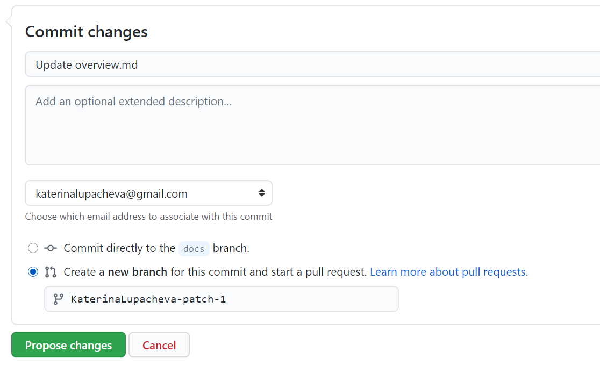
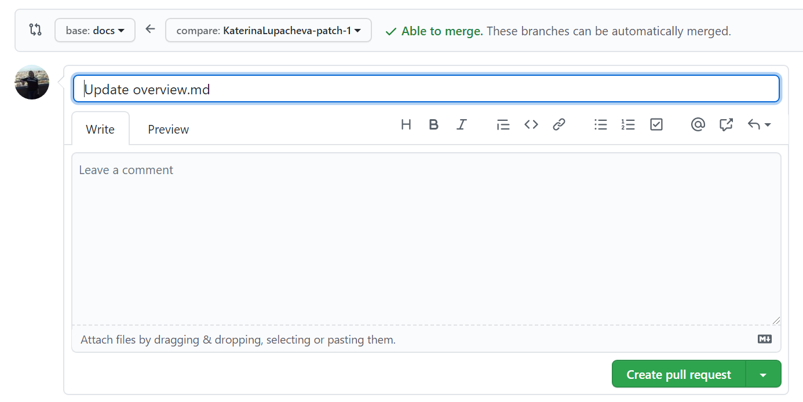

# sko-public/docs

This branch contains a source code for the **sikobaPay User Documentation**, developed with [Docusaurus](https://docusaurus.io/).

The project deployed as a web app [here](https://sikoba-docs.netlify.app).

## How to edit docs

### Prerequisites

- To be able to edit docs, you must have a GitHub account. If you don't have one, you can sign up [here](https://github.com/)

#### To edit existing docs

1. Click on *Edit* button at the top of any doc page.

2. Make changes using [Markdown](https://www.markdownguide.org/) markup language.
3. In the *Commit changes* section write a short description of changes, choose *Create a new branch for this commit and start a pull request* and click *Propose changes*.

4. On the next page click *Create pull request*.

