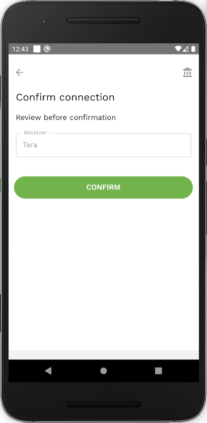
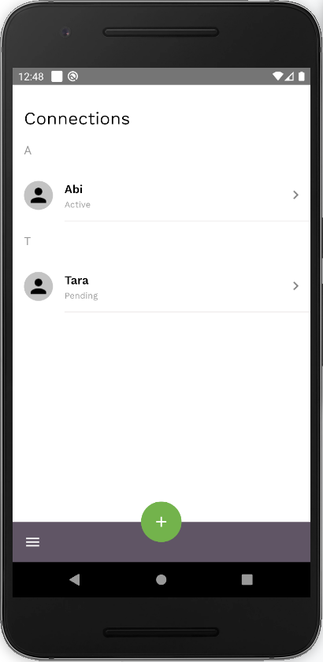

To add a new connection, click on the ‘+’ button at the bottom of the connections screen. You can then either:

- Scan the QR code of the user that you want to connect to
- Or enter the name of the user that you want to connect to
- Then click ‘confirm’

    
    

    
    

    

