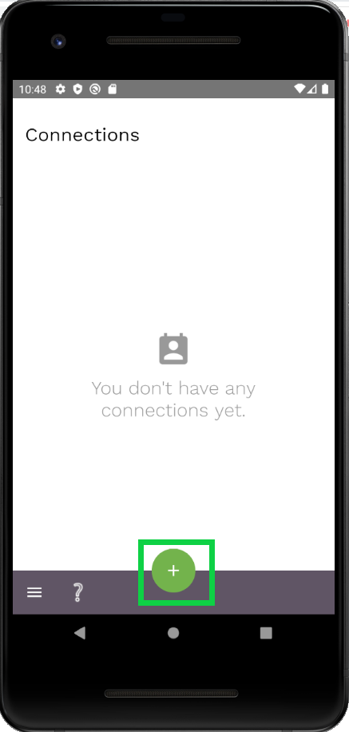
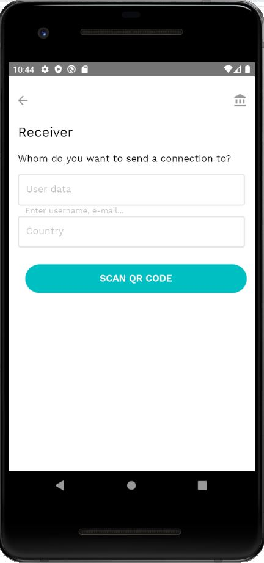
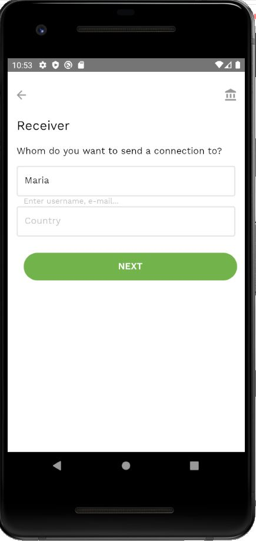
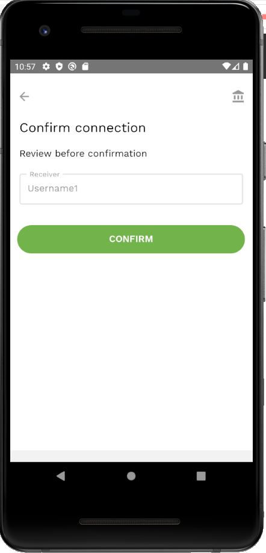
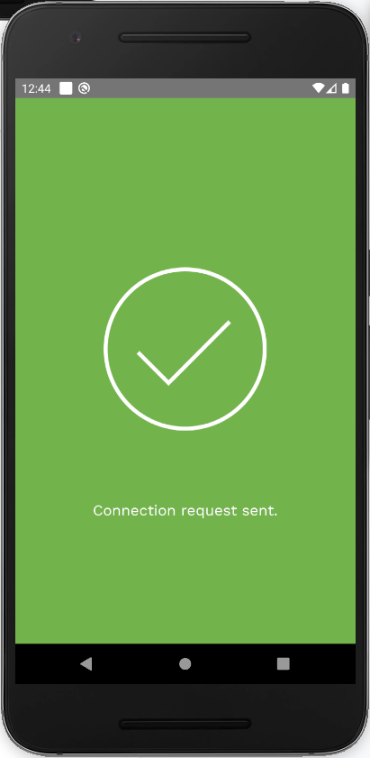
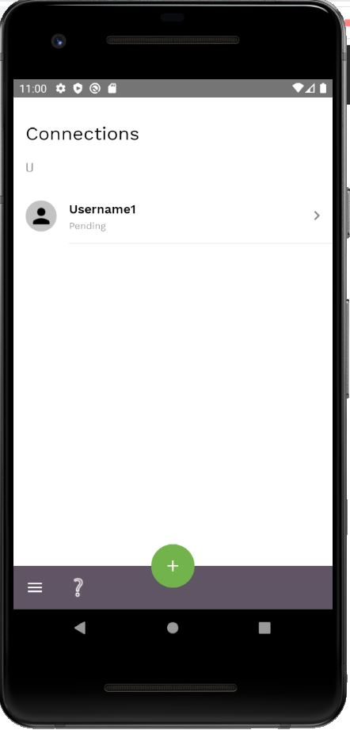

To add a new connection:

- Click on the  button at the bottom of the connections screen.

- Then you can then either:

  - Scan the QR code of the user that you want to connect to

  - Or search a user by any [searchable parameter](vocabulary.md#privacy-level).  
  
  - And/Or enter the country name of the user that you want to connect to

- Then click *Next*

- Choose the user that you want to connect to from a list of users with matching data and tap on it

- Review the data and tap *Confirm*

- After a connection request sent, you'll see your new connection with *Pending* status 
  

