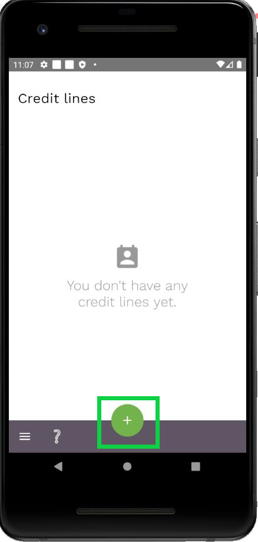
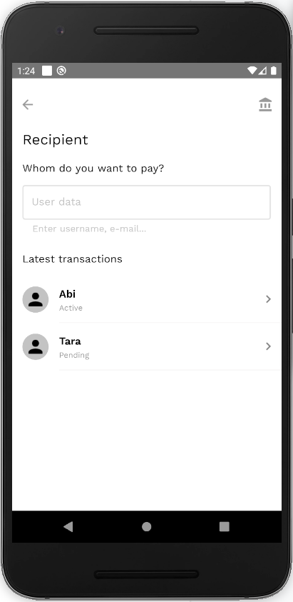
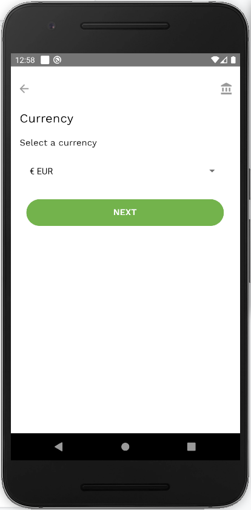
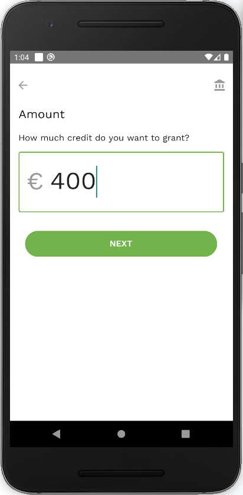
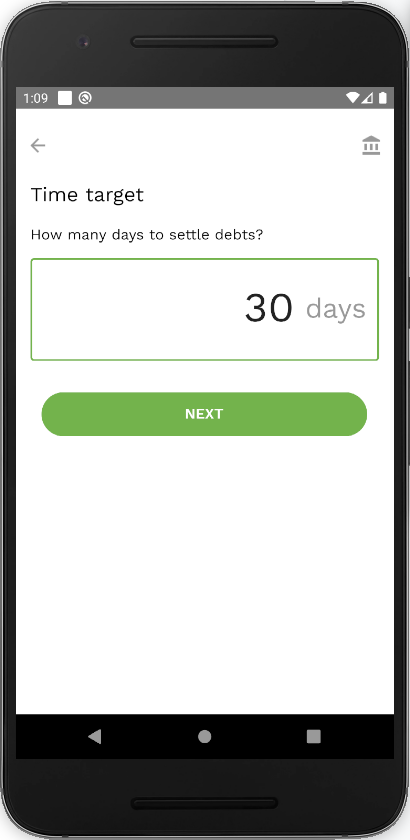
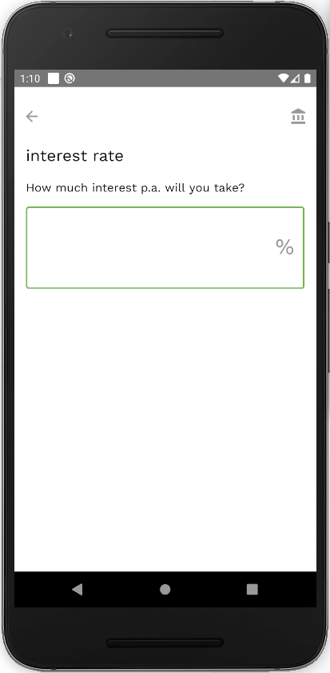
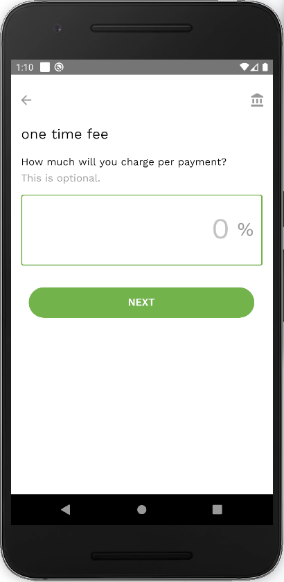
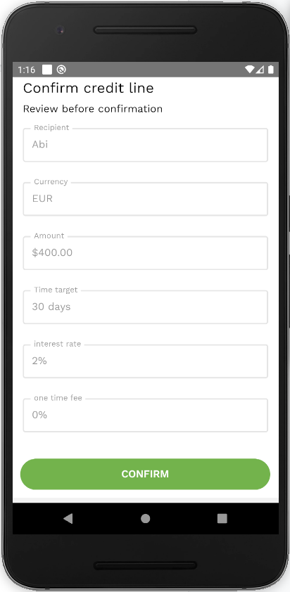

To add a new credit line:

- Click on the  button at the bottom of the credit lines screen.

- Choose one of the existing connections you have or type in the username of the person who you want to grant a credit line to.

- Choose the currency in which you want to grant a credit line.

- Enter the credit line limit.

- Enter the time target. The Time target is the number of days after which the debtor will have to settle the debt.

- Enter the interest rate. This refers to an annualised interest rate.

- Enter a one-time fee amount in %. This is optional and should generally be set to 0%.

- Confirm the created credit line by pressing on the ‘Confirm’ button.

