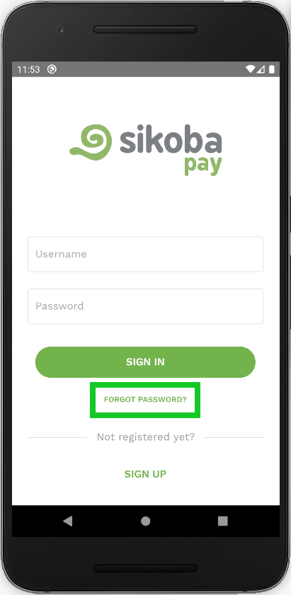
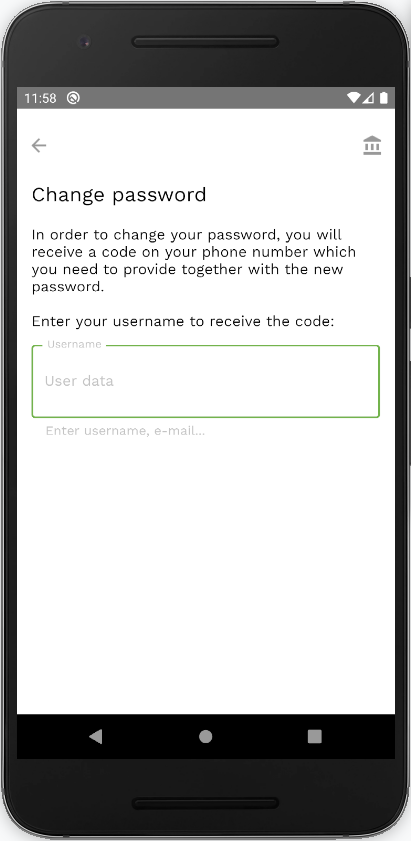
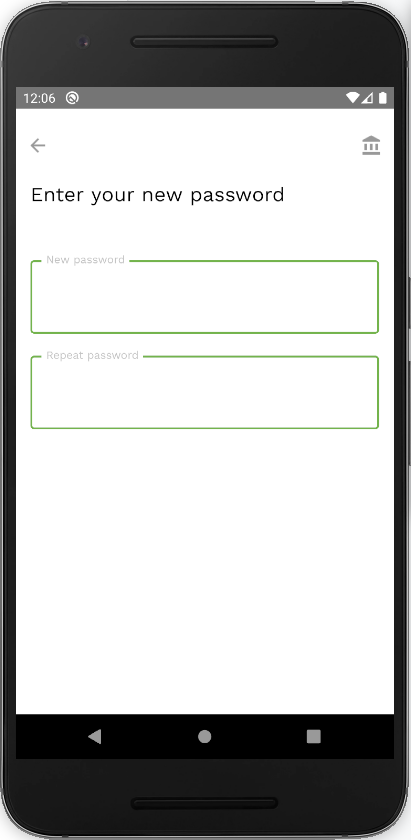
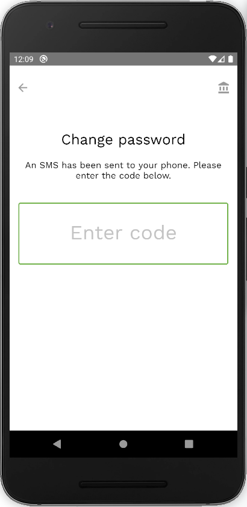

To change a password:

- Click on ‘Forgot password?’ in the sign-in screen.

- In order to change your password, confirm your username by typing your handle or your email address. Tap *Continue*.

- Enter your new password and confirm it within the field below.

- Enter the verification code that has been sent to your phone number.

