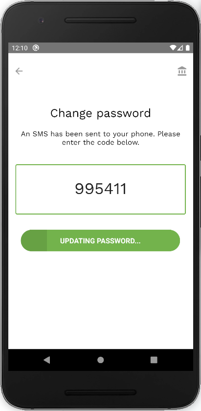
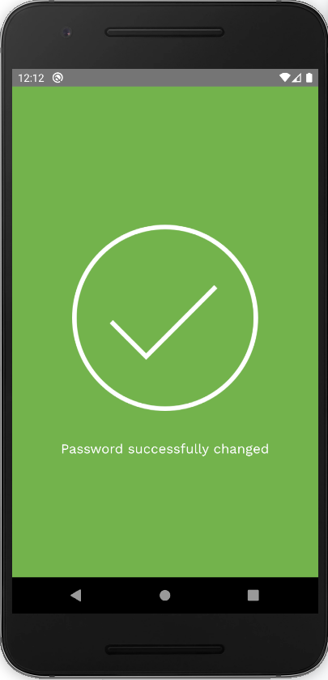

To change a password, click on ‘Forgot password?’ in the sign-in screen.
You will be sent a verification code, to confirm this action on your phone number.

In order to change your password, confirm your username. You can either confirm your user name by typing your handle or your email address. Enter your new password and confirm it within the field below.
Enter the verification code that has been sent to your phone number.

    
    

    
    

    
    

