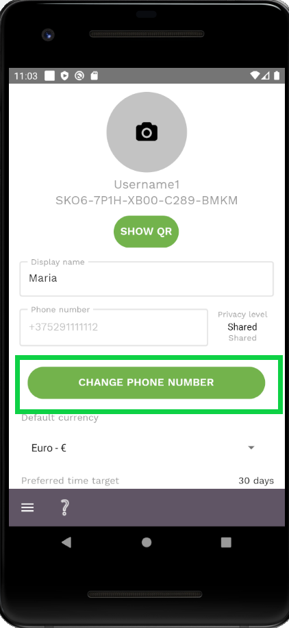
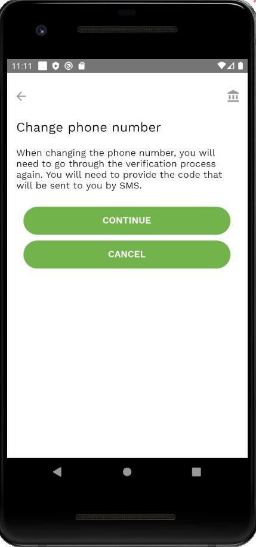
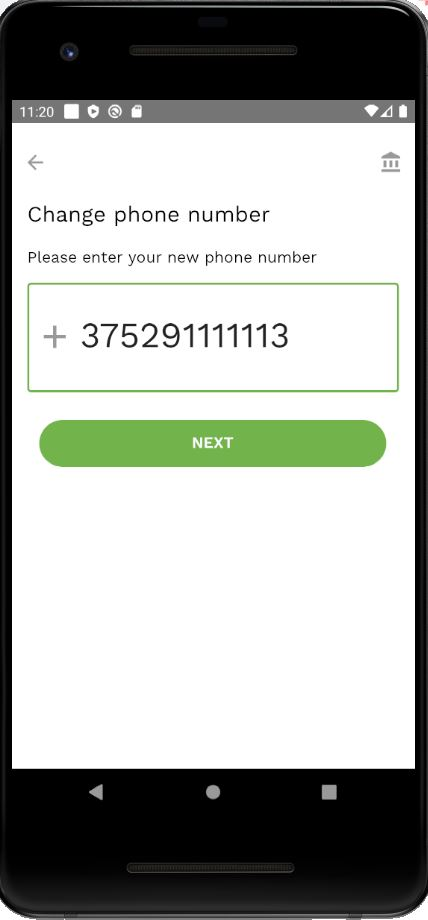
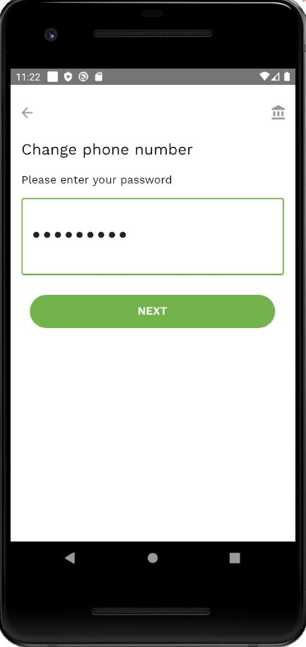

**NOTE**: if you change your phone number, you'll need to go through the [verification process](verify-phone-number.md) again.  

To change the phone number:

- Click on the *Change phone number* button in the [Settings screen](settings-screen.md).

- Click *Continue* on the next info screen.  

- Enter your new phone number and tap *Next*.

- Enter your password and tap *Next*.

- Review the data and tap *Confirm*.

