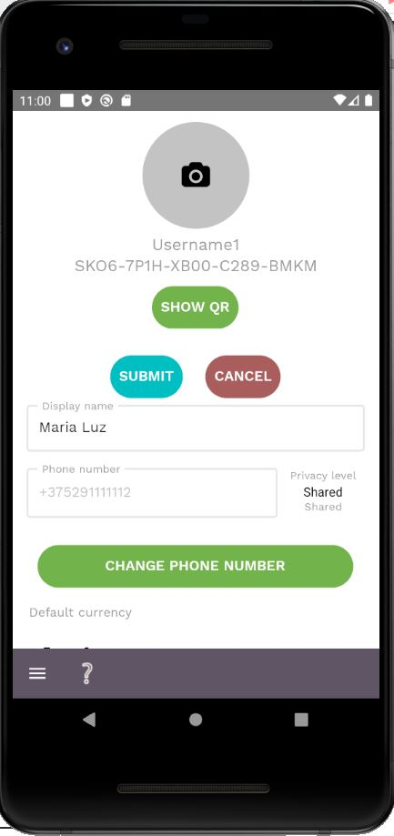

To change any user data, such as display name, preferred currency and settlement period as well as clearing flexibility, app's language, it suffices to change any of the fields and click on the *Submit* button that shows under the user avatar.

