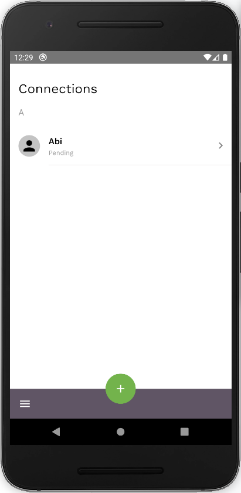
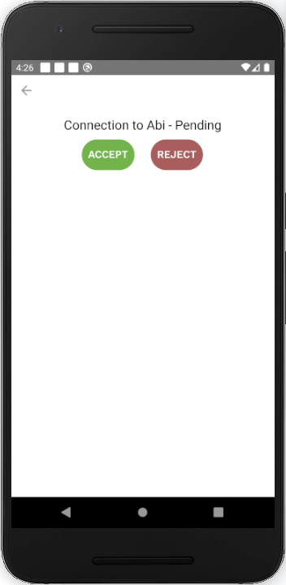

This screen shows you all of your connections and their status, which can be:

- Pending - A connection that needs to be accepted by one user
- Active - A connection that has been accepted by both users
- Inactive - A connection that has been rejected by one user
- Cancelled - A connection that has been cancelled by one user

By clicking on a ‘Pending’ connection you are taken to a screen where you can choose to:

- Accept
- Cancel - When a connection is cancelled it's permanently deleted, both users can still make future connection requests to each other. 
- Reject - When a connection is rejected, it prevents the sender of the request from sending additional connection requests to that user-- think of it as spam prevention. It can be reactivated by the rejecting user.

You can also:

- Add a new connection by pressing on ‘+’ button
- Open the menu by clicking on the Menu icon

    
    

