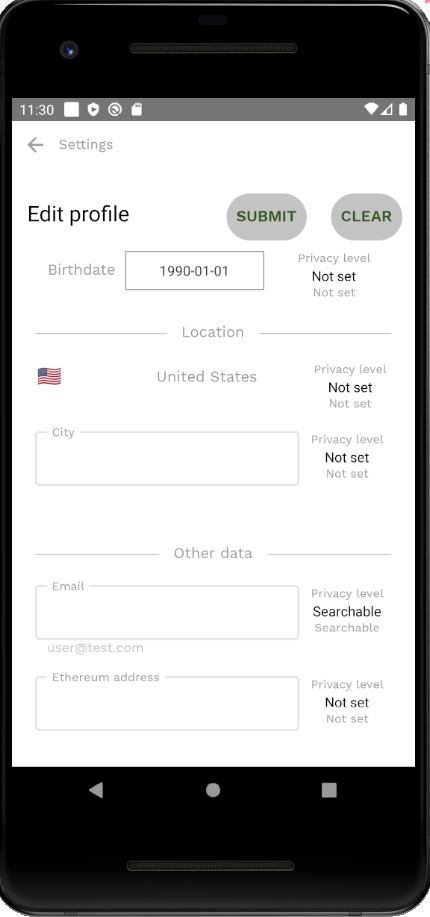

To edit your profile data:

- Click on the *Edit profile* button on the [Settings screen](settings-screen.md)

- You can change and set a [privacy level](vocabulary.md#privacy-level) of your:

  - First name
  - Last name
  - Birthdate
  - Country and city of residence
  - Email
  - Ethereum address

- Change any of these fields and click on the *Submit* button at the top of the screen

