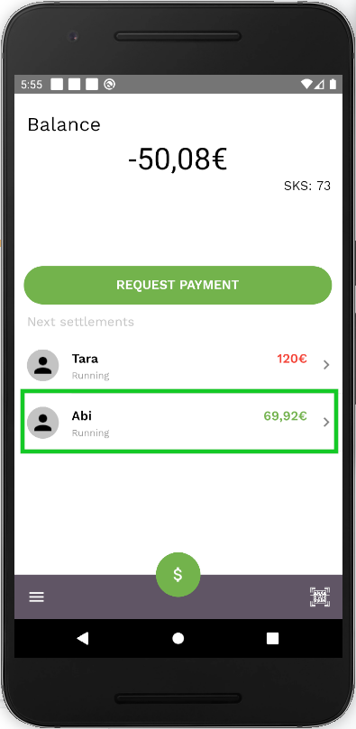
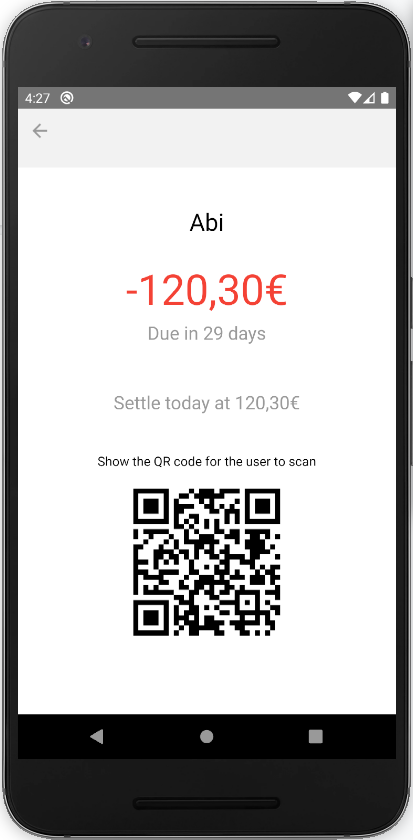

To make it easier for someone to find an IOU that you have created, you can show them a QR code of the IOU. This can be useful when you need to get your IOU settled and save time for the settler finding the IOU.

To get the QR code of the IOU, click on the IOU in a IOU list. (either in balance screen or in credit line screen).

