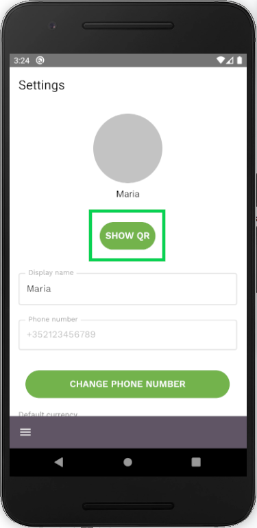
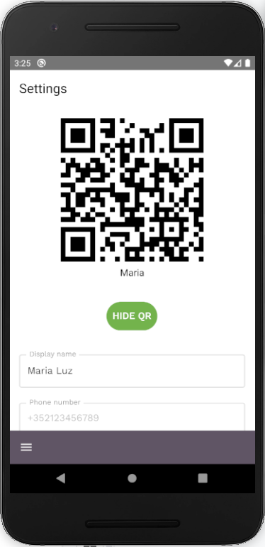

A user can scan your user QR code in order to find your account in the system and connect. This QR code is accessed by opening the Settings screen, and clicking the ‘Show QR’ button, underneath the Avatar image.

