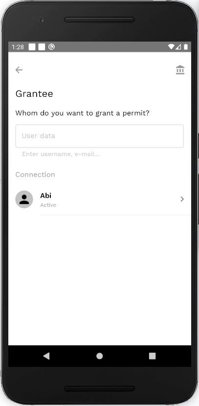
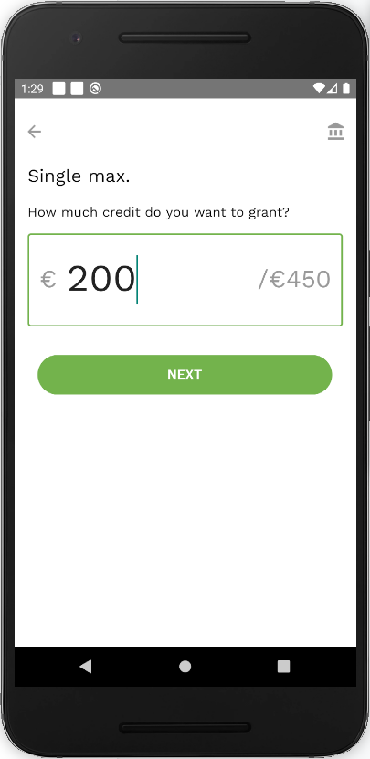
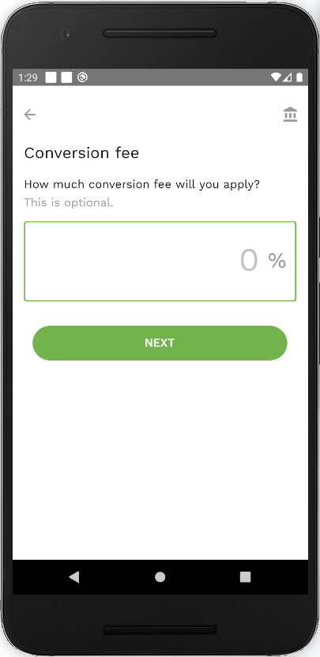
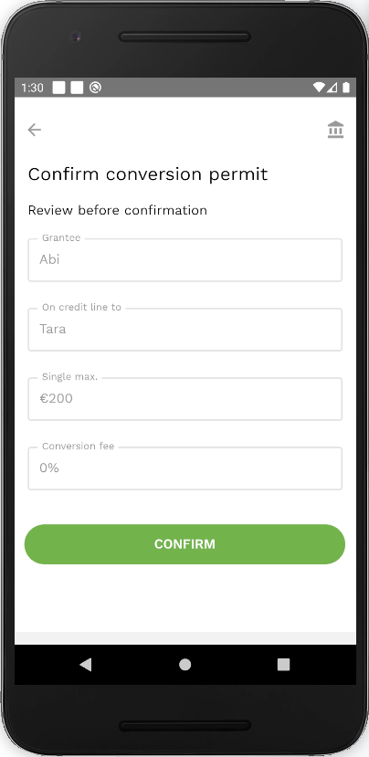
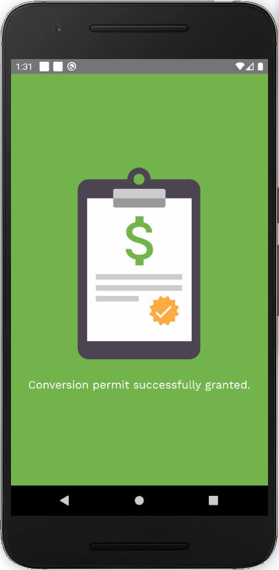

To grant a [conversion permit](vocabulary.md#conversion-permit):

- *If you are granting a permit right after setting up a conversion profile, please skip this step.*

   On a [credit lines screen](credit-lines-screen.md), select a needed credit line, tap on it, then click the *Grant Permit* button in the credit line details screen.

- Choose the user you want to grant the permit to - either by selecting the name or typing it in the box.

- Enter the amount of credit you want to grant.

- Enter the [conversion fee](vocabulary.md#conversion-fee) you want to charge.

- Check the conversion permit details and click *Confirm*.

