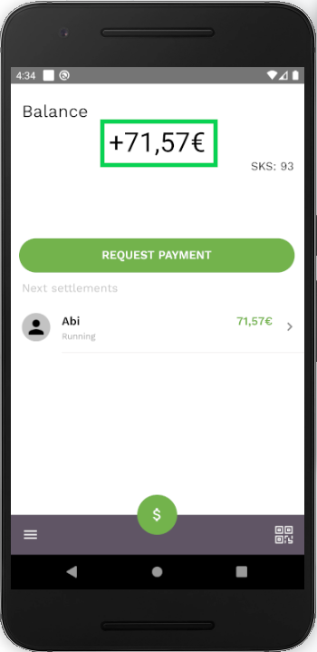
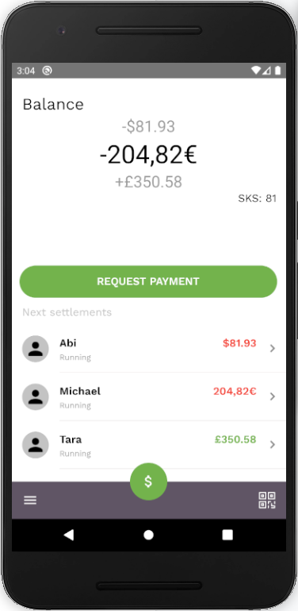

## Balance screen

    
    

The first screen you will see is the **Balance Screen**. This screen displays:

- Your current balance
- Allows you to [request a payment](request-payment.md)
- Shows your next settlements

You can also:

- [Make a payment](make-payment.md) to one of your connections using the  button
- Open the [menu](menu.md) using the  icon
- Use the QR code icon  in bottom right corner to scan [QR codes](qr-codes.md)

## Balance

Your balance is the total of the IOUs you have paid and the IOUs people have paid you in each currency.
By tapping the balance amount at the top of the screen, you can scroll down and see your balance for all of the currencies you are using.

## SKS

SKS tokens are needed for any transactions you take. For more details on SKS, check out the [token section](tokens.md).

## Next settlements

This section displays all the active IOUs you currently have. This includes both IOUs you have paid and IOUs that people have paid you. You can see more about an IOU in detail by tapping on it.
