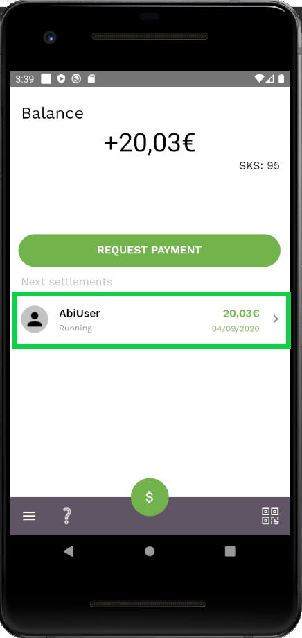
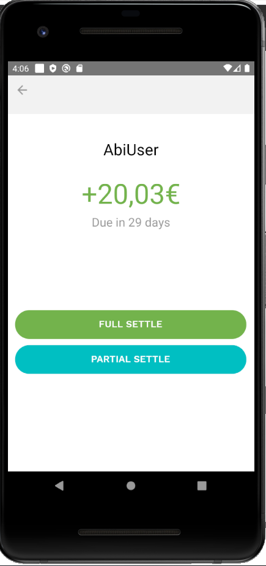

When a user settles an IOU that they have paid you:

- Select the IOU on either in the balance screen or in the credit line details screen. This will open the detailed view of IOUs.

Then you can choose

- ‘Full Settle’ to fully settle the IOU
- ‘Partial Settle’ to settle just a part of the IOU. The remainder of the IOU’s total amount and the provided amount will be represented by a new IOU

