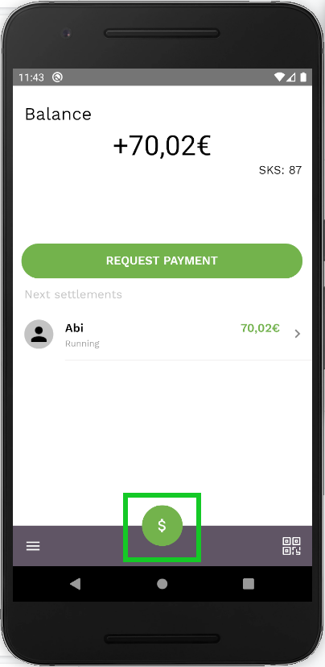
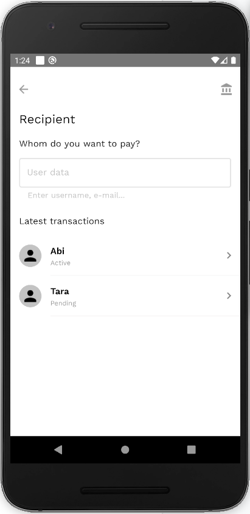
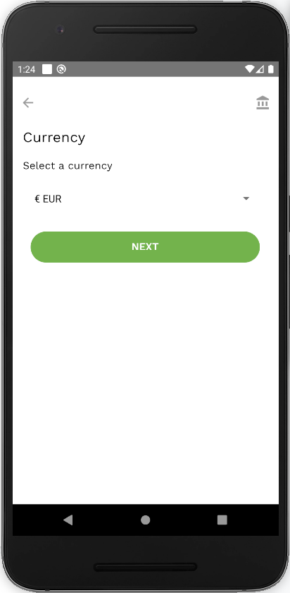
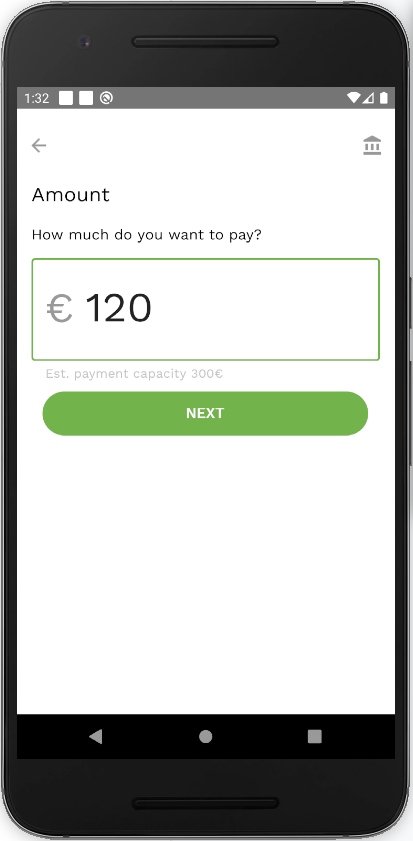
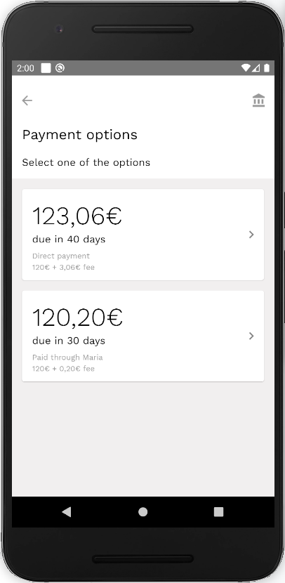
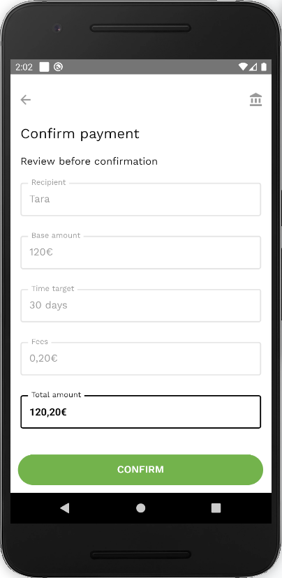
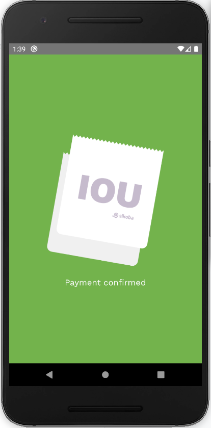

To create a new payment:

- Click on the ‘$’ button at the bottom of the balance screen.

- Choose an existing connection or type in the username of the person you want to pay.

- Choose the currency in which you want to pay. Usually, it’s the currency in which you were granted a credit line.

- Enter the amount.

- Select one of the available payment options.

- Check the details and confirm payment by pressing on the ‘Confirm’ button.

- Once confirmed, payment will appear within your [Balance screen](home.md).
