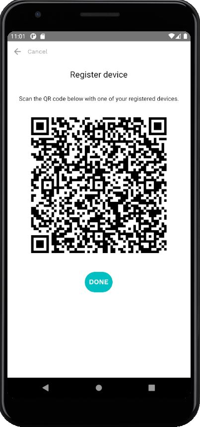

## Register a new device

When you try to log in under your credentials using a new device (not the one that you used when creating an account), you need to register this new device first.

To do so:

- enter your username and password on the [Sign in screen](sign-in.md) and tap *Sign in* button.

- then you'll see an info screen that this device is not registered. You can register the device by choosing one of the options:
  - using another **registered** device - tap on the *Device* option
  - or using your [master key](vocabulary.md#master-key) - tap on the *Master key* option

## Register with another registered device

If you choose to register your new device with another registered device, the app will generate a QR-code that you should scan with one of your registered devices.

To scan this QR-code, open sikobaPay app on your registered device and tap on the QR code icon  in bottom right corner of the [Balance screen](home.md).

## Register with your master key

If you choose to register your new device with the master key, then you'll be prompted to enter your master key (12 words) that was generated during [sign up](sign-up.md) process.

Enter each word of your master key in a respective field and press *Done* button.
