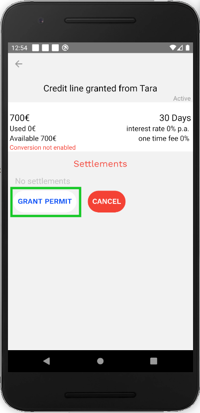
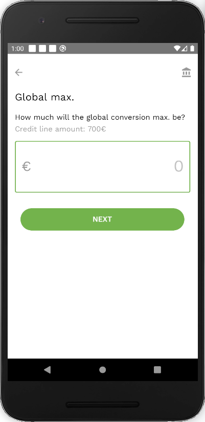
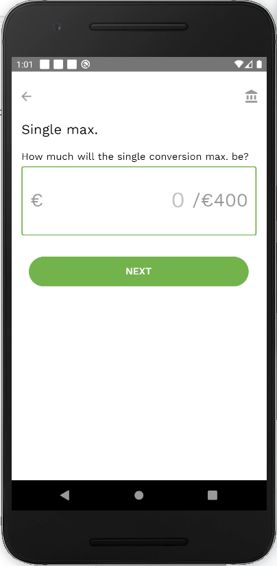
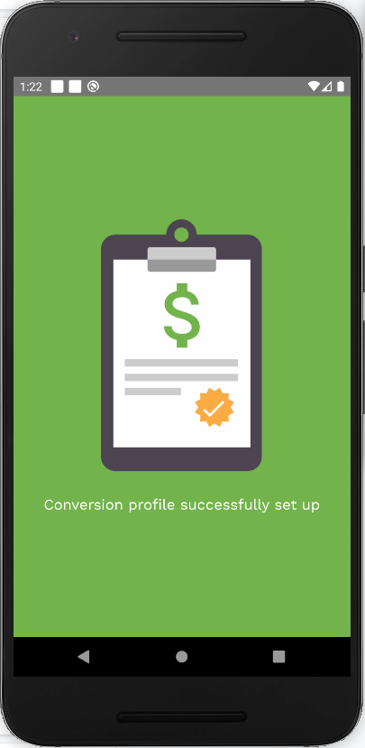

To grant a conversion permit:

- Click the ‘Grant Permit’ button in the credit line details screen.

- If the conversion profile has not been set, you will first need to do this. This is only done once per credit line, just before granting the first permit.

- Input the [global conversion maximum](vocabulary.md#global-conversion-max).

- Input a [single conversion maximum](vocabulary.md#single-conversion-max).

- Confirm the created conversion profile by pressing on the ‘Confirm’ button.

