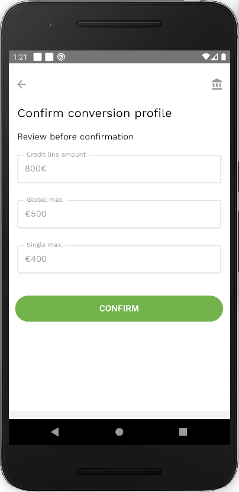

To enable a [credit conversion](vocabulary.md#credit-conversion) feature, a conversion profile for a specific credit line should be set. This is only done once per credit line, just before granting the first permit.

For that:

- On a [credit lines screen](credit-lines-screen.md), choose a credit line for which you'd like to enable a credit conversion, and tap on it.

- Click the *Grant Permit* button in the credit line details screen.

- Input the [global conversion maximum](vocabulary.md#global-conversion-max).

- Input a [single conversion maximum](vocabulary.md#single-conversion-max).

- Confirm the created conversion profile by pressing on the ‘Confirm’ button.

