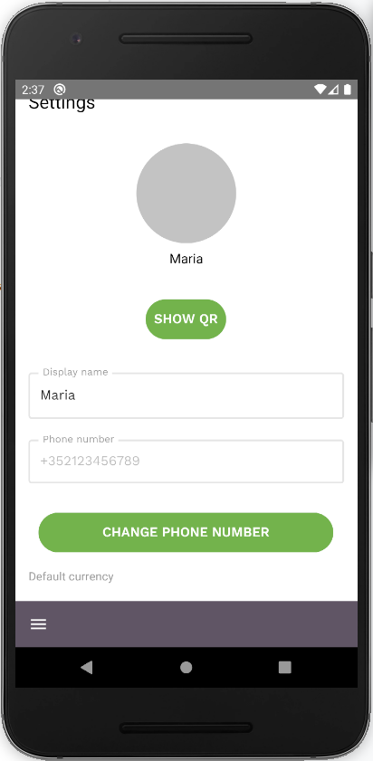
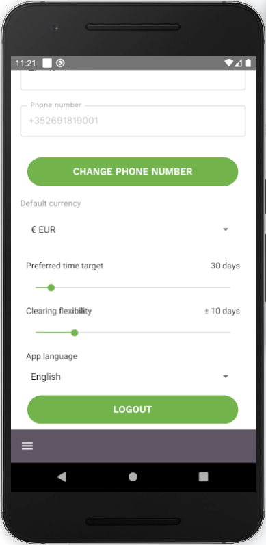

This screen shows you your user settings, you can:

- Change your phone number
- Select your default currency
- Select your preferred Time Target
- Select your [Clearing Flexibility](vocabulary.md#clearing-flexibility)
- Select your language
- Logout
- Show your QR code
