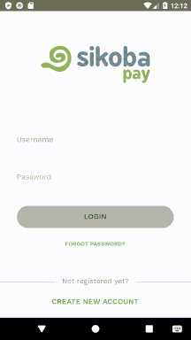

**NOTE**: When you try to sign in under your credentials using a new device (not the one that you used when creating an account), you need to [register](register-device.md) this new device first or you can continue to use the device in a [read-only mode](read-only.md).

To sign in, enter your:

- Username
- Password
- Click *Sign In*

