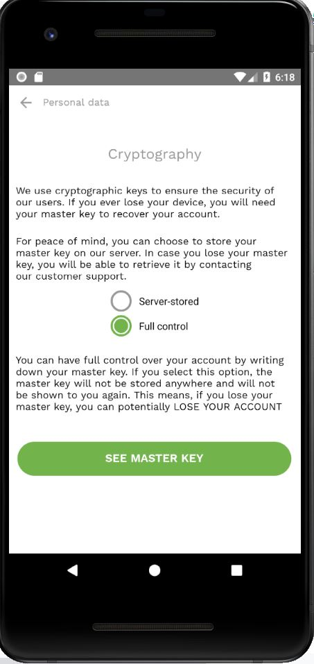

## Personal data

- Select a username, choose a password, repeat a password and enter your beta key (can be obtained by emailing betatesters@sikoba.com)

- Tap *Next*

- Select your country, enter city (optional), your display name (required), first name (required), last name (required), birthdate (required), your phone number including the country code (required), email (optional) and Ethereum address (optional). Then tap *Next*

## Cryptography

Select how do you prefer to store your [master key](vocabulary.md#master-key).

You can choose to store your master key on [our server](sign-up.md#server-stored) or you can have a [full control](sign-up.md#full-controll) over your account by writing down your master key.

## Server-stored

If you choose to store your master key on our server:

- check *Server-stored* option and tap *Confirm*.

- review all your data and tap *Create account*

## Full controll

If you choose to have a full control over your account:

- check *Full control* option and tap *See master key*

- **WRITE DOWN** your master key (12 words). If you lose it, you can potentially LOSE YOUR ACCOUNT.

- **optionally**, you can protect your master key with a password by choosing this option (or you can skip this step).

  - Enter a master key password, repeat it and tap *Confirm*.

  

  - Confirm that you have written down the twelve words.

  

- Review all your account information and tap *Create account*

