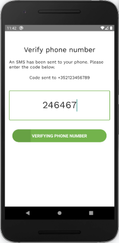

Before being able to use the functionality of the app, you must first verify your phone number. This is done using a code that is sent to your device by SMS immediately after you complete the sign-up process.

To start the verification procedure, click on the top part of the screen. To finalize the verification, enter the code that has been sent to your phone number and click submit.

    
    

    
    

