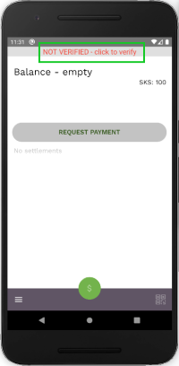
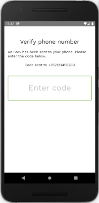
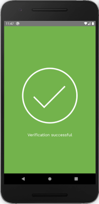

Before being able to use the functionality of the app, you must first verify your phone number. This is done using a code that is sent to your device by SMS immediately after you complete the sign-up process.

To verify your phone number:

- click on the top part of the screen

- enter the code that has been sent to your phone number

- click *Submit*

