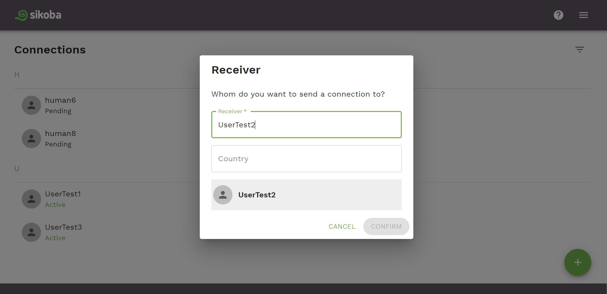

To add a new connection:

- Click on the  button at the bottom of the connections screen.

- Then you can then either:

  - Find a user by entering a username, email, or any other [searchable parameter](vocabulary.md#privacy-level) of the user you want to connect to
  - And/Or find users by country

- Review the data and click *Confirm* button

- After a connection request sent, you'll see your new connection with *Pending* status

