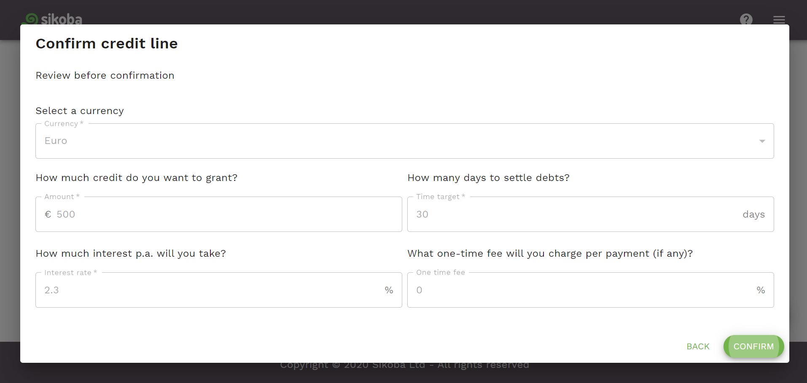

To add a new credit line:

- Click on the  button at the bottom of the credit lines screen.

- Then you can grant a credit line:

  - To a **single user** by choosing one of the existing connections you have

  

   - OR to **multiple users** by turning a switch to a *Multiple* user position and selecting respective connections. In this case a credit line with the same parameters will be granted to all selected connections

  

  *Hint*: a connection can be found by entering a username in the search field.

  - Click *Next* button

- On the next screen:

  - select the currency in which you want to grant a credit line

  - enter the credit line amount

  - enter the [time target](vocabulary.md#time-target)

  - enter the interest rate. This refers to an annualized interest rate.

  - enter a one-time fee amount in %. This is optional and should generally be set to 0%.

  

  - Click *Next* button

- Review the data and click *Confirm* button

