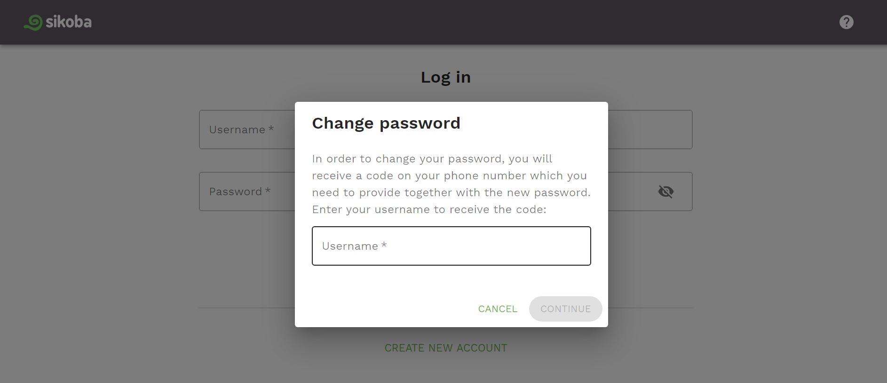

To change a password:

- Click on ‘Forgot password?’ in the sign-in screen

- In order to change your password, confirm your username by typing your username. Click *CONTINUE*.

- Enter your new password, confirm it and enter the verification code that has been sent to your phone number. If you didn't receive the code, click *RESEND* button.

Click *SUBMIT*.

