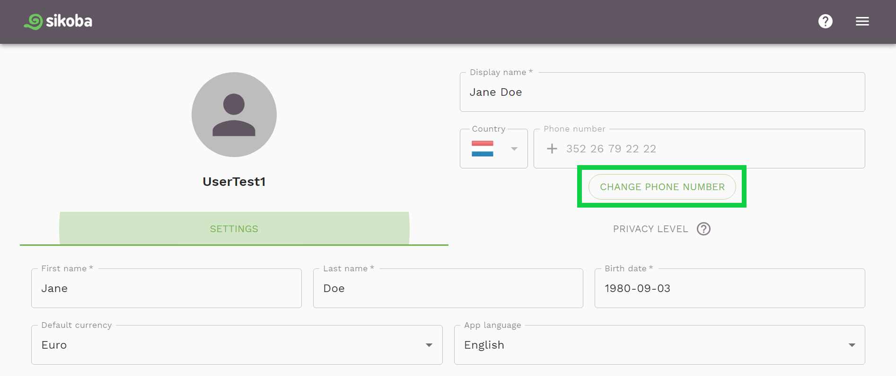
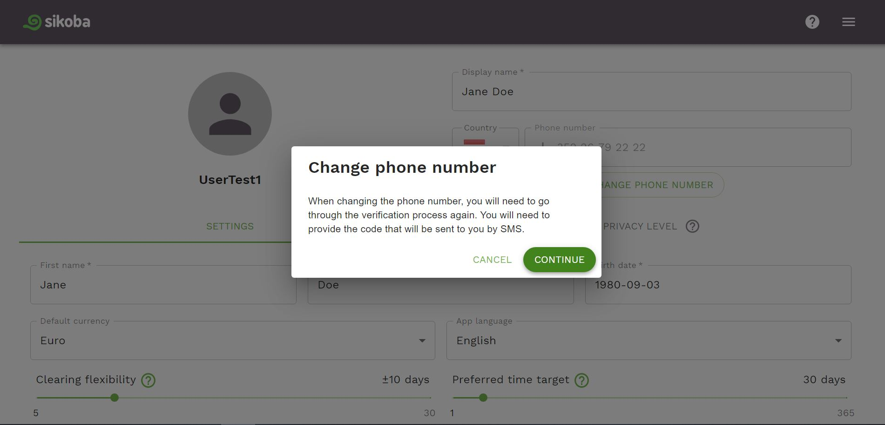
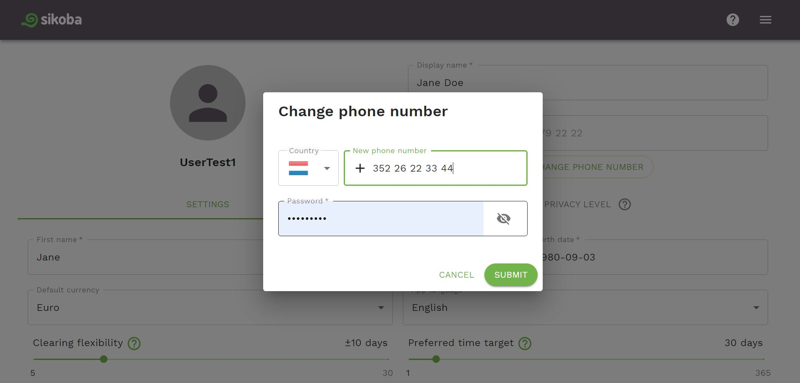
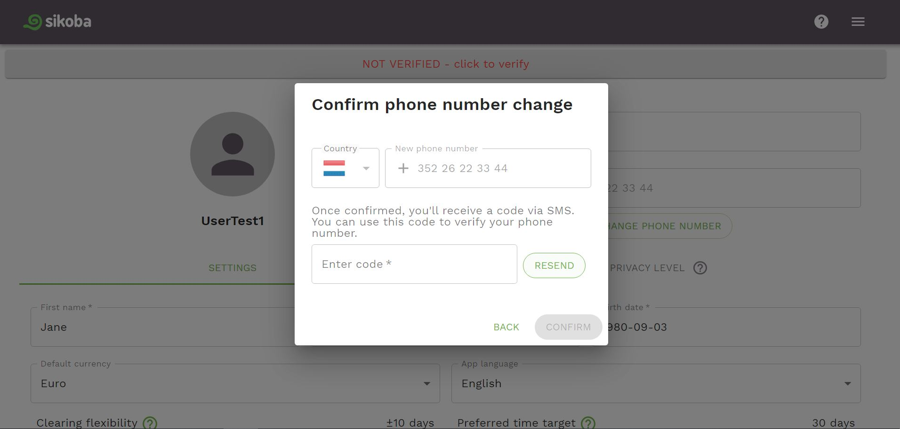

**NOTE**: if you change your phone number, you'll need to go through the [verification process](verify-phone-number.md) again.  

To change the phone number:

- Click on the *Change phone number* button on the [Settings page](settings-page.md).

- Click *Continue* on the next info screen.

- Enter your new phone number and your password. Then click on the *Submit* button.

- To verify your new phone number, enter the code that has been sent to your phone number. If you didn't receive the code, click *RESEND* button. Click *Confirm* button.

