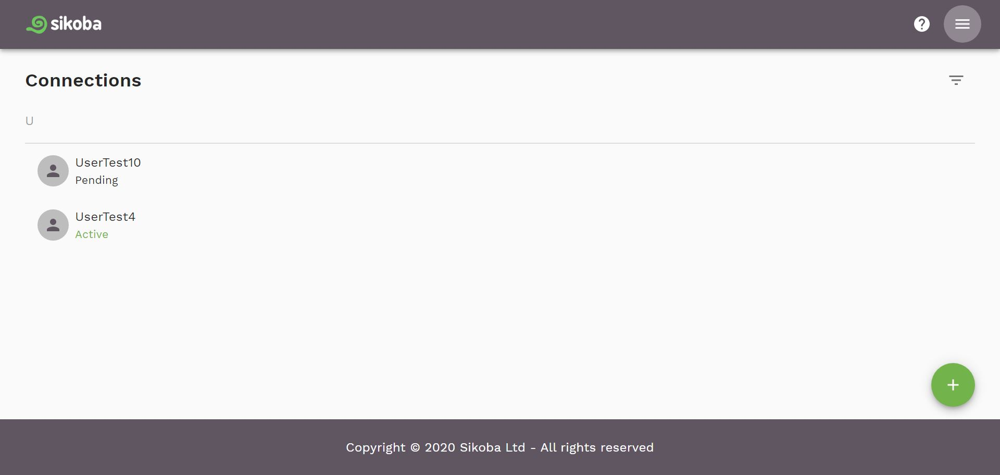
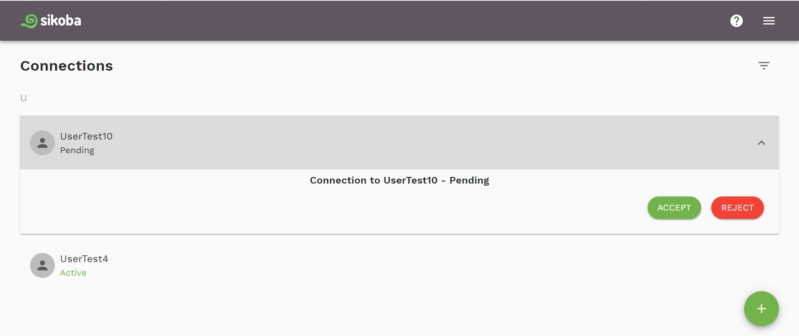
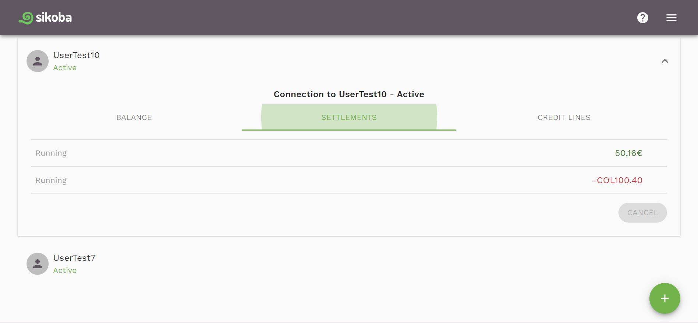

## Connections page

This screen shows you all of your **connections** and their **status**, which can be:

- **Pending** - A connection that needs to be accepted by one user
- **Active** - A connection that has been accepted by both users
- **Inactive** - A connection that has been rejected by one user
- **Cancelled** - A connection that has been cancelled by one user

## Pending connections

By clicking on a *Pending* connection, you'll see the options where you can choose to:

- **Accept** - accept requested connection.
- **Reject** - When a connection is rejected, it prevents the sender of the request from sending additional connection requests to that user-- think of it as spam prevention. It can be reactivated by the rejecting user.

## Active connections

By clicking on an *Active* connection, you can see the following information about your mutual transactions with this connection:

- **Balance**
- **Settlements**
- **Credit lines**

If you don't have any running settlements with this connection, you can **cancel** it by clicking on the *Cancel* button.

## Additional operations

You can also:

- [Add a new connection](add-new-connection.md) by pressing on  button
- [Open the menu](menu.md) by clicking on the Menu  icon

