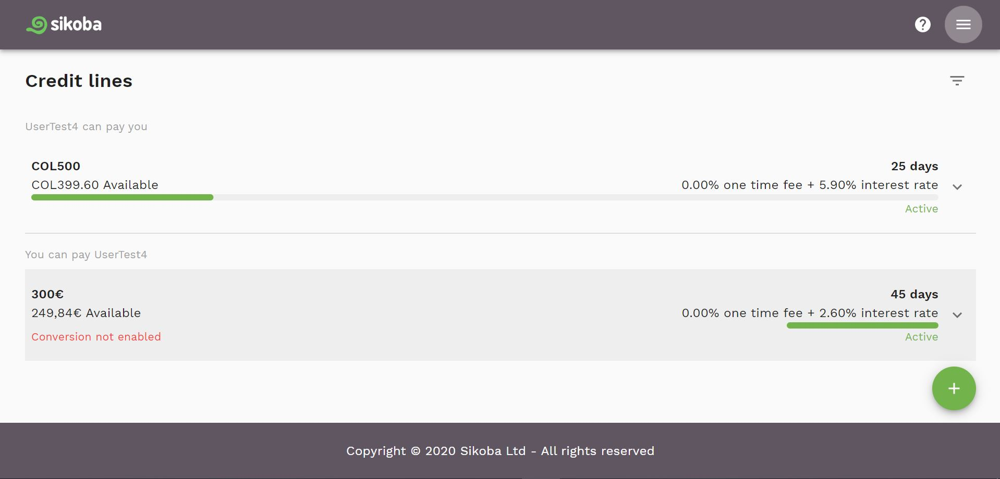
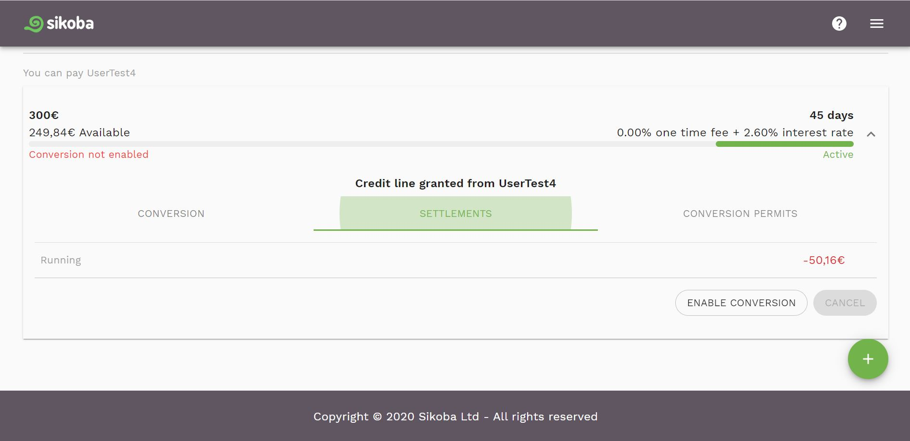

The Credit Lines screen shows you all of your active credit lines. Showing you:

- Who you can pay
- Who can pay you

For each credit line you can see:

- The credit limit
- The amount of the credit limit used
- The status of the credit limit (active, pending, inactive, cancelled)
- The one-time fee for using the credit line
- The interest rate for using the credit line
- The time target - how many days you can have an IOU before you must settle it
- Whether credit conversion has been enabled - for credit lines you can pay people with
- The credit conversion limit
- The amount of credit conversion used

It also allows you to:

- [Add new credit line](add-new-credit-line.md), using the  button
- Open the [menu](menu.md) by clicking on the Menu  icon