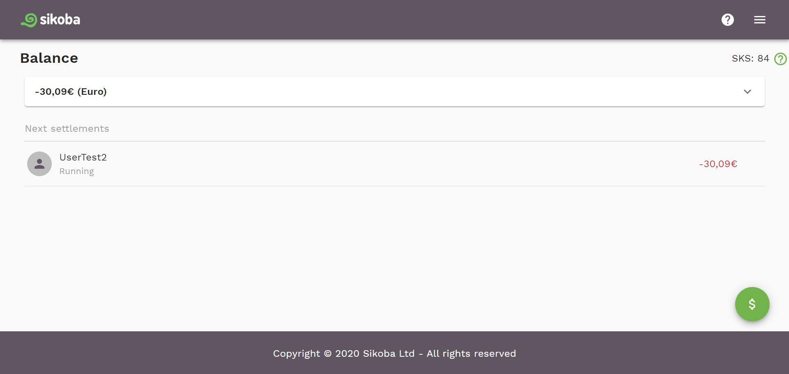

## Dashboard

This page displays:

- Your [current balance](#balance)
- Shows your [next settlements](#next-settlements)
- Available [SKS tokens](#sks)

You can also:

- [Make a payment](make-payment.md) to one of your connections using the  button
- Open the [menu](menu.md) using the  icon

## Balance

Your balance is the total of the IOUs you have paid and the IOUs people have paid you in each currency.
By clicking the balance bar at the top of the screen, you can see your balance for all of the currencies you are using.

## SKS

SKS tokens are needed for any transactions you take. For more details on SKS, check out the [token section](tokens.md).

## Next settlements

This section displays all the active IOUs you currently have. This includes both IOUs you have paid and IOUs that people have paid you. You can see more about an IOU in detail by clicking on it.

