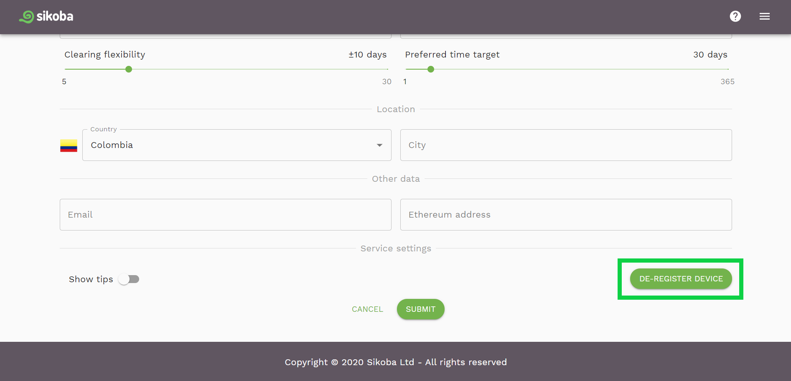
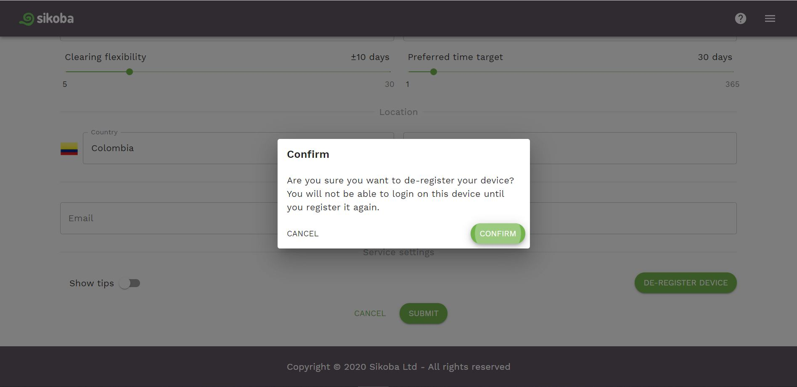

**If you have more than one registered device**, you can cancel the registration of any of your devices. For that:

- on any of your registered devices, for which you would like to cancel the registration, go to the [settings page](settings-page.md)

- click on the *De-register device* button at the bottom of the page

- read the notification and press *Confirm*

