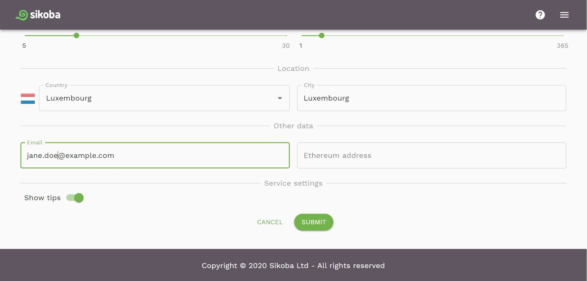
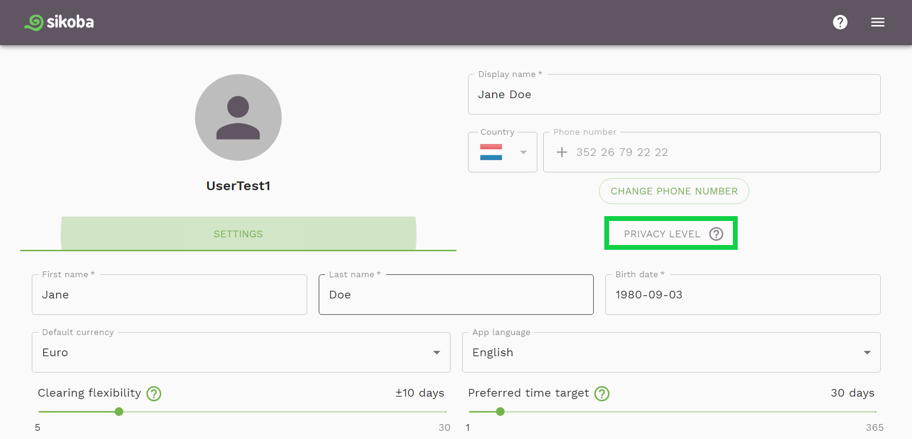
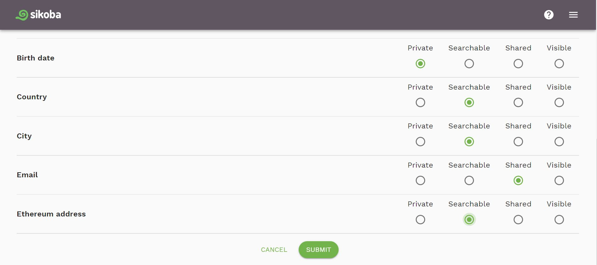

## Edit profile

To change any user data displayed on the [Settings page](settings-page.md), such as:

- display name
- first name
- last name
- birth date
- preferred currency
- app language
- clearing flexibility
- time target
- location (country and city)
- email
- Ethereum address

 it suffices to change any of the fields and click on the *Submit* button that shows at the bottom of the page.

 

## Change privacy level

You can change and set a [privacy level](vocabulary.md#privacy-level) of your:

- Phone number
- First name
- Last name
- Birthdate
- Country and city of residence
- Email
- Ethereum address

For that:
  
- select the *PRIVACY LEVEL* tab on the [settings page](settings-page.md)

- set a privacy level for any available field(s) and click *Submit* button that shows at the bottom of the page.

