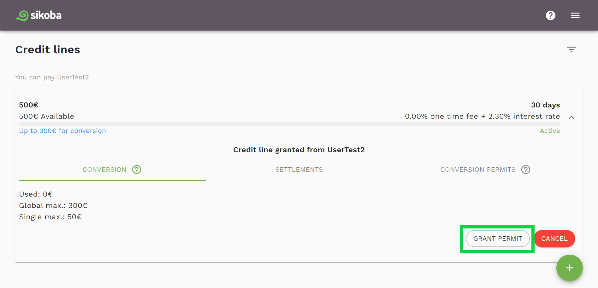
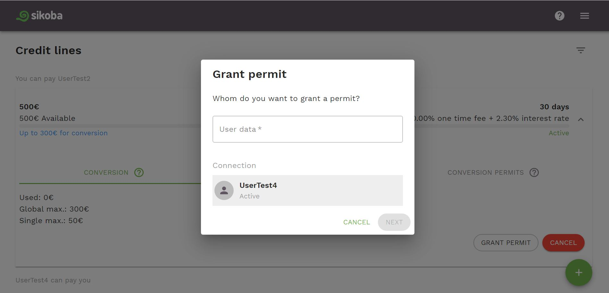
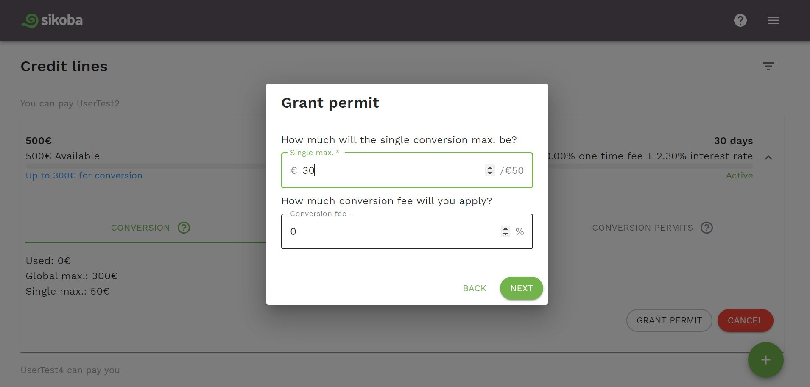
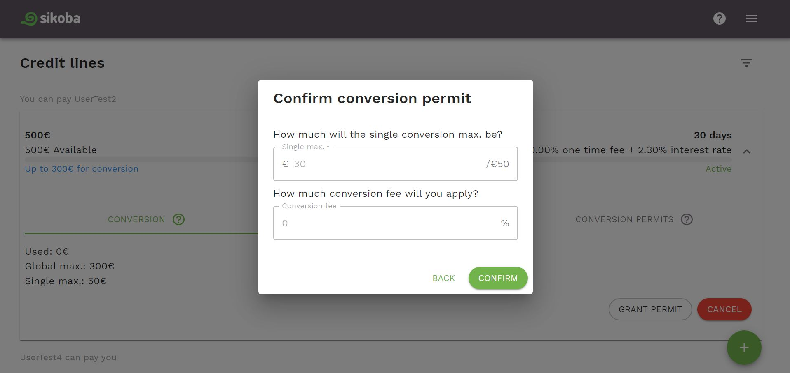

**NOTE: a [conversion permit](vocabulary.md#conversion-permit) can be granted only for the connection (another user) to whom you have opened a credit line.**

To grant a [conversion permit](vocabulary.md#conversion-permit):

- On a [credit lines page](credit-lines-page.md), select a needed credit line with an *Active* status, click on it, then click the *Grant Permit* button in the credit line details section.

- Choose the user you want to grant the permit to - either by selecting her/him from the list or typing a username in the search field.

- Enter the amount of a [single conversion max.](vocabulary.md#single-conversion-max) and the [conversion fee](vocabulary.md#conversion-fee) (can be left 0%). Click *Next* button.

- Review the data and confirm the granted conversion permit by pressing on the *Confirm* button.

