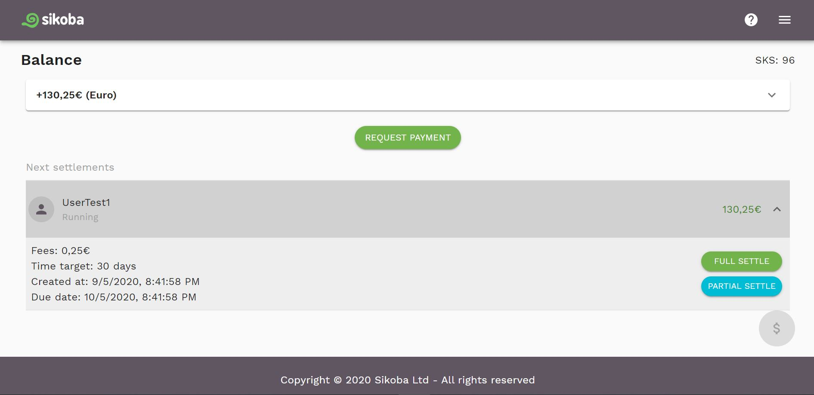
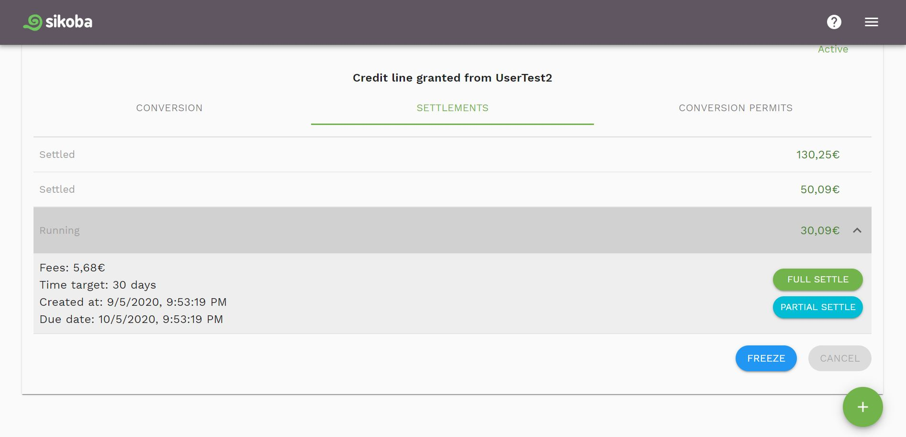

When a user settles an IOU that **they have paid you**, you can:

- select the IOU which you would like to settle and click on it on the [dashboard page](dashboard.md). This will open the detailed view of IOUs.

- OR go to the [credit lines page](credit-lines-page.md), select the credit line for which you'd like to settle the IOU, click on the Settlements tab, then choose the IOU that you'd like to settle (should have *Running* status).

Then you can choose:

- [Full Settle](full-iou-settlement.md) to fully settle the IOU
- [Partial Settle](partial-iou-settlement.md) to settle just a part of the IOU. The remainder of the IOU’s total amount and the provided amount will be represented by a new IOU.
