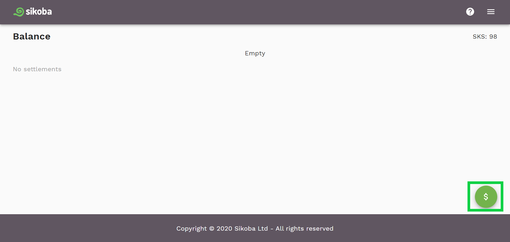
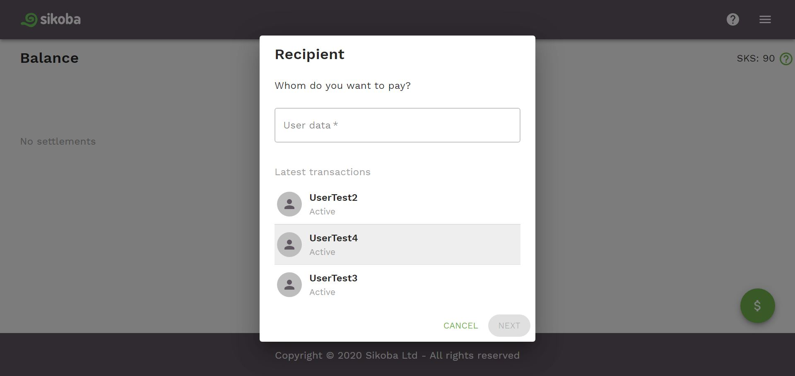
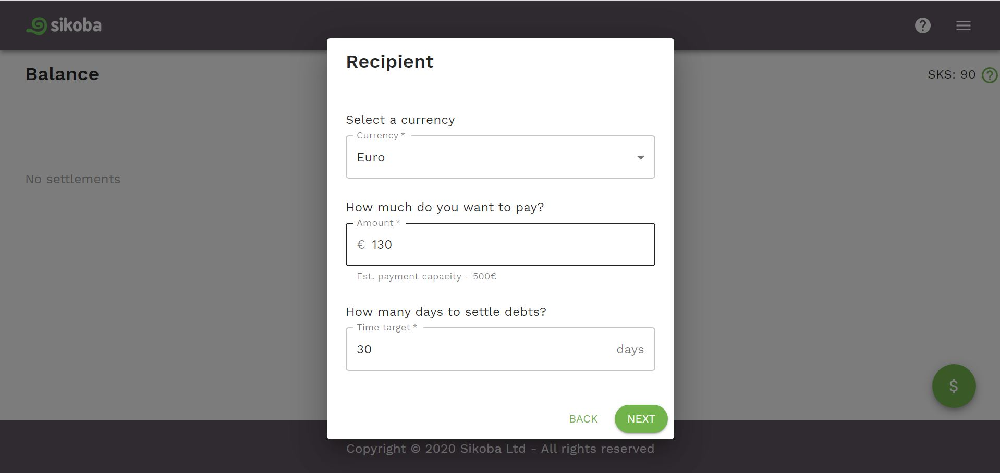
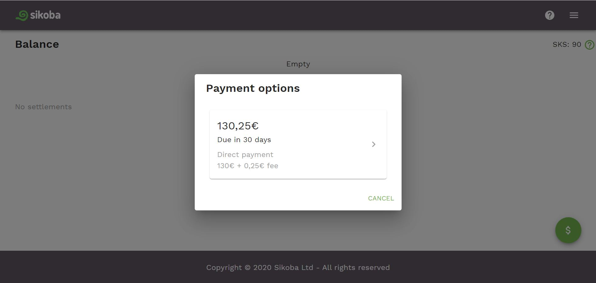
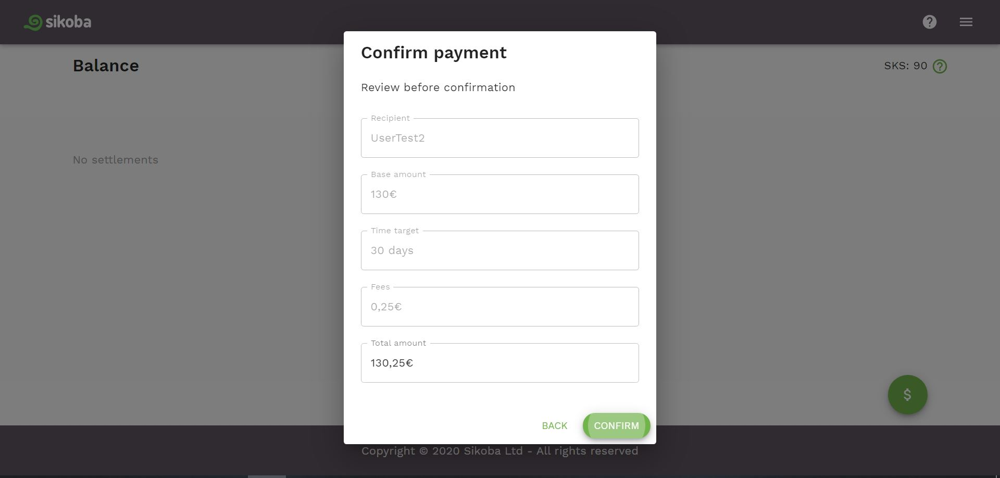

**NOTE: you can make a payment to another user only:**

-  **if that user granted a credit line to you**
- **OR if you have a common connection who granted a conversion permit to you**

To create a new payment:

- Click on the  button at the bottom of the [dashboard page](dashboard.md).

- Choose an existing connection or type in the username of the person you want to pay and click *Next* button.

- On the next screen:
  - choose the currency in which you want to pay. Usually, it’s the currency in which you were granted a credit line.
  - Enter the amount.
  - Enter the [time target](vocabulary.md#time-target). Note, that it could be less or equal to the time target that is set up for the credit line.

  Click *Next* button.

  

- Select one of the available payment options.

- Check the details and confirm payment by pressing on the *Confirm* button.

