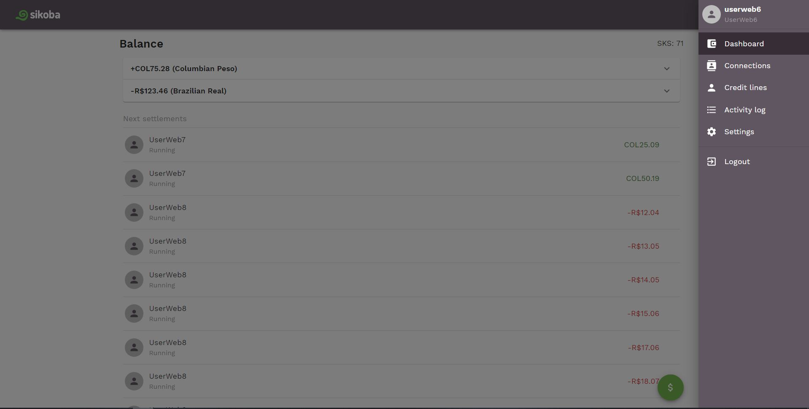

The **menu** allows you to open:

- [Dashboard page](dashboard.md)
- [Connections page](connections-page.md)
- [Credit lines page](credit-lines-page.md)
- [Activity log page](activity-log.md)
- [Settings page](settings-page.md)

Or to logout from the app.
