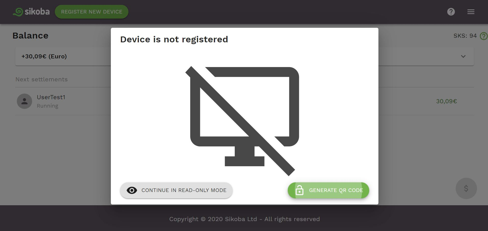

When you are signing in into your account from the unregistered device, you can choose to use the app in a read-only mode.

In this mode you can see all the information about your account, like balance, next settlements, connections, granted credit lines, your profile info, etc, but you can't perform any transactions or update your profile data.

If you'd like to use the full version of the app, you can register your device by clicking on the *Register new device* button at the top of the screen (in a read-only mode).

Then click "Generate QR code" button and [use another your registered device](register-device.md#register-with-another-registered-device).
