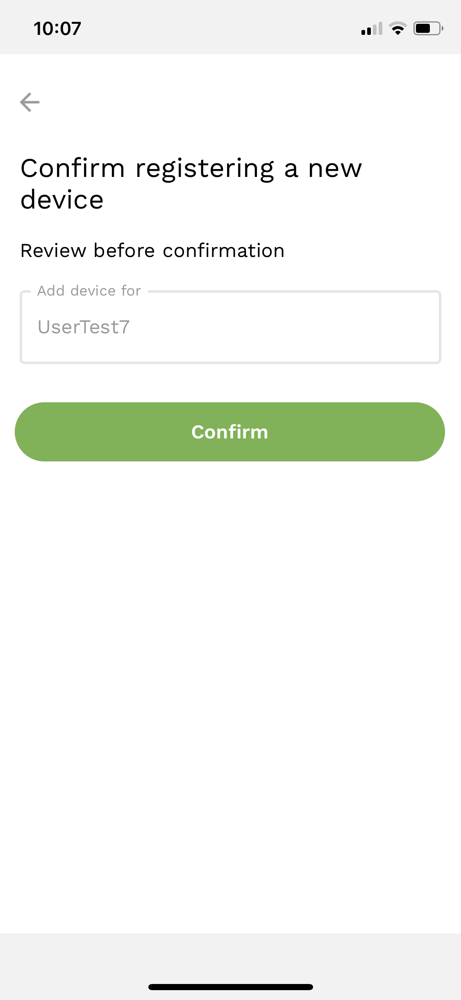

## Register a new device

To do so:

- enter your username and password on the [Login page](sign-in.md) and click *Login* button.

- then you'll see an info screen that this device is not registered. You can:
  - Generate QR-code and scan it using another **registered** device
  - OR continue to use the device in a [read-only mode](read-only.md)

**NOTE**: you can [de-register](de-register-device.md) any of your devices at any time.

## Register with another registered device

If you choose to register your new device with another registered device, the app will generate a QR-code that you should scan with one of your registered devices. By default, the device will be registered for one hour. If you would like to register the device permanently, check the *Permanent* option.

To scan this QR-code:

- open sikobaPay app on your registered device and tap on the QR code icon  in bottom right corner of the [Balance screen](../home.md).

**IMPORTANT**: you should be logged in under the same credentials on both devices: the one that you are using as a registered device and the second that you'd like to register.

- scan the QR-code and tap *Confirm* button

