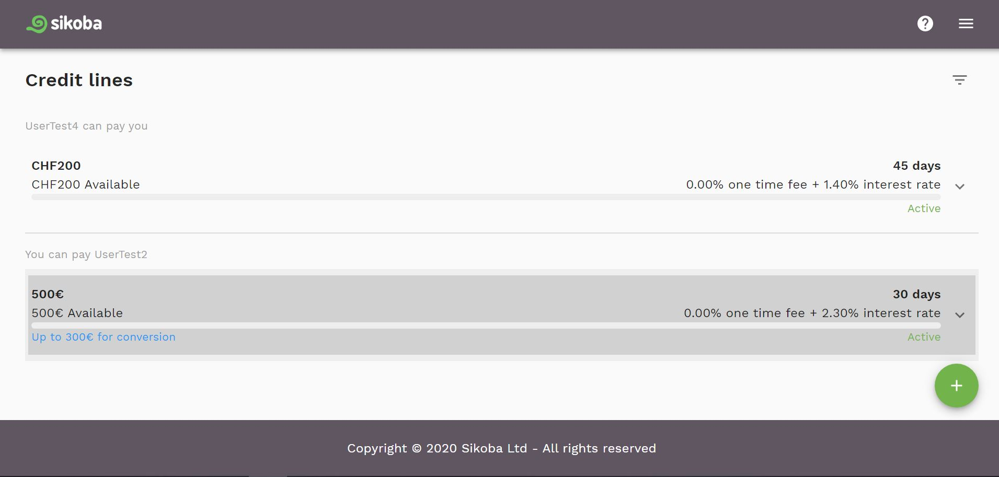
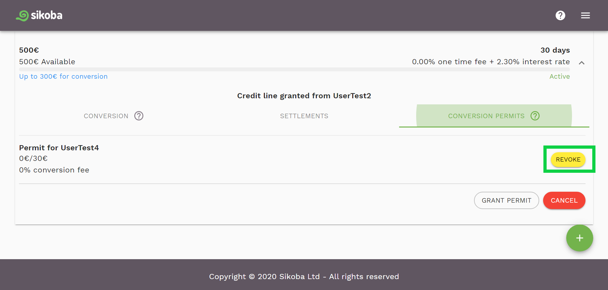

To revoke any permit that you have granted:

- On a [credit lines page](credit-lines-page.md), choose a credit line for which you'd like to revoke a credit conversion permit, and click on it.

- Click on the *Revoke* button on the permit that you want to revoke on the Conversion permits tab.

