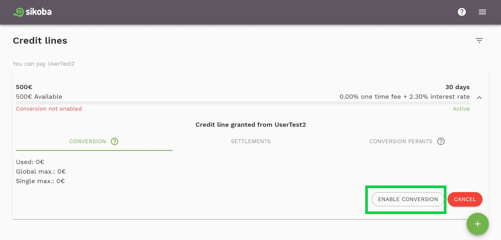
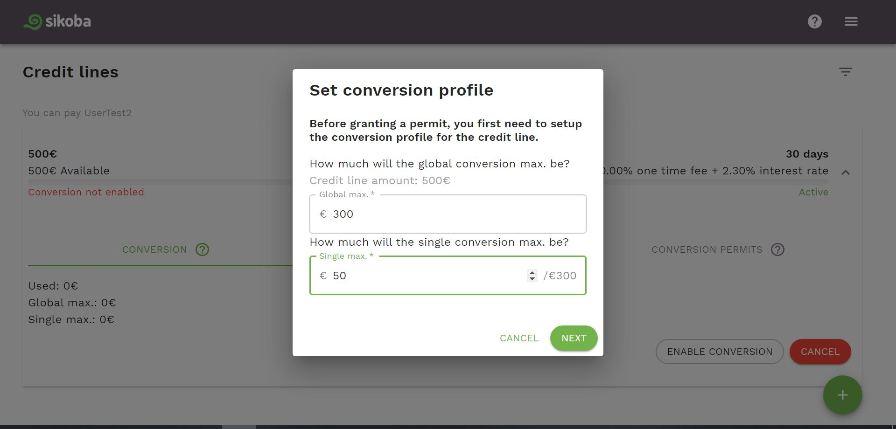
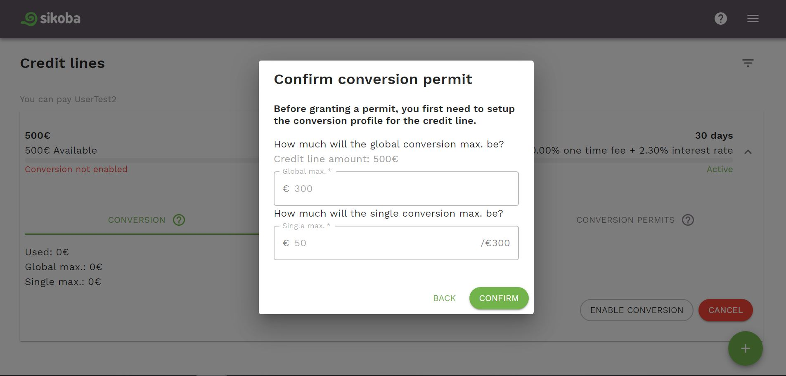
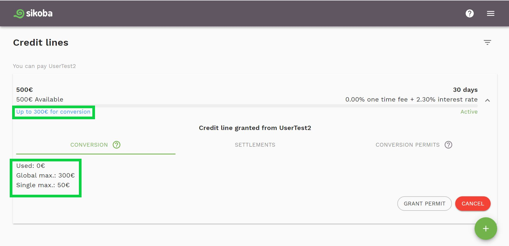

To enable a [credit conversion](vocabulary.md#credit-conversion) feature, a conversion profile for a specific credit line should be set. This is only done once per credit line, just before granting the first permit.

For that:

- On a [credit lines page](credit-lines-page.md), choose a credit line for which you'd like to enable a credit conversion, and tap on it.

- Click the *Enable conversion* button on the Conversion tab

- Enter [global conversion maximum](vocabulary.md#global-conversion-max) and [single conversion maximum](vocabulary.md#single-conversion-max). Click *Next* button.

- Review the data and confirm the created conversion profile by pressing on the *Confirm* button.

- You'll see that the conversion profile enabled and its details on the [credit lines page](credit-lines-page.md).

