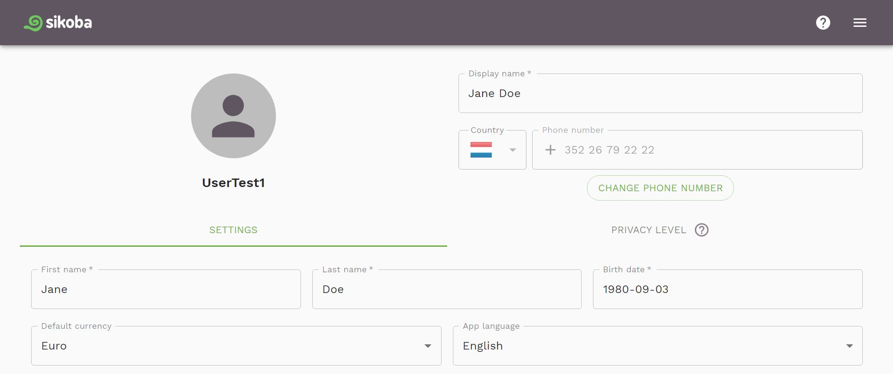
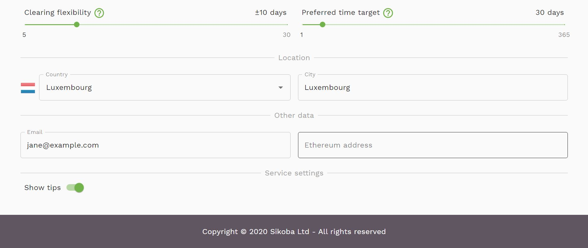

This screen shows you your user settings, you can:

- Change your display name
- [Change your phone number](change-phone-number.md)
- Change a [privacy level](vocabulary.md#privacy-level) of your data
- Update your first name, last name and birth date
- Select your default currency
- Select app's language
- Select your [Clearing Flexibility](vocabulary.md#clearing-flexibility)
- Select your preferred [Time Target](vocabulary.md#time-target)
- Update information about your location: country and city
- Change your email
- Change your Ethereum address
- Select to show or not to show help tips
- Add/change your photo (*coming soon*)
