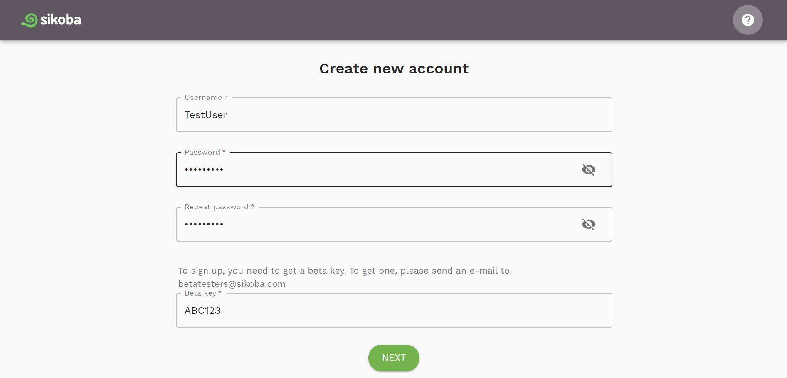
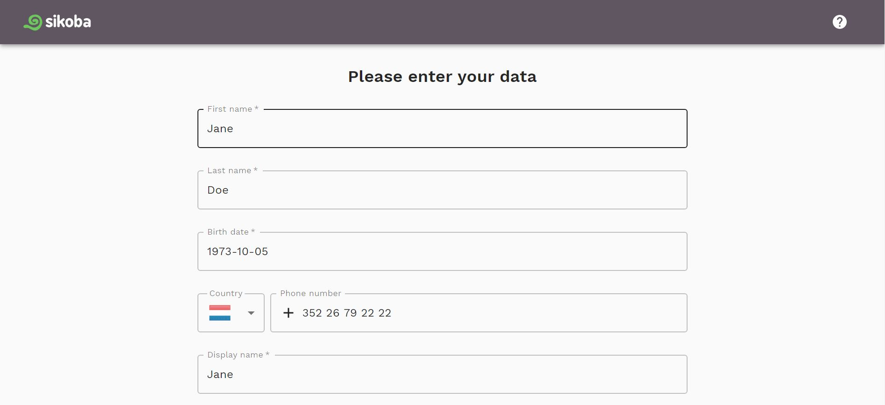
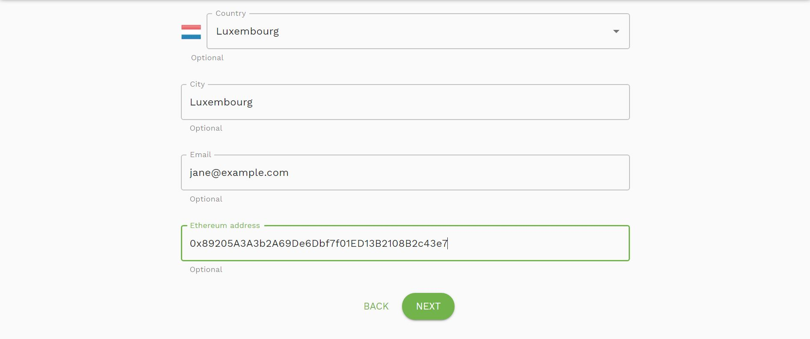
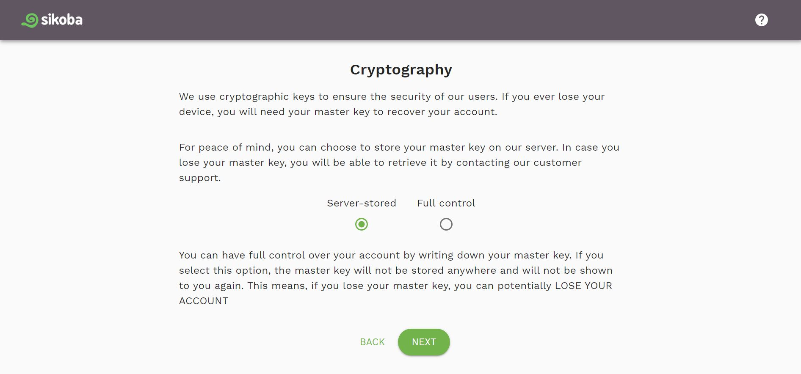
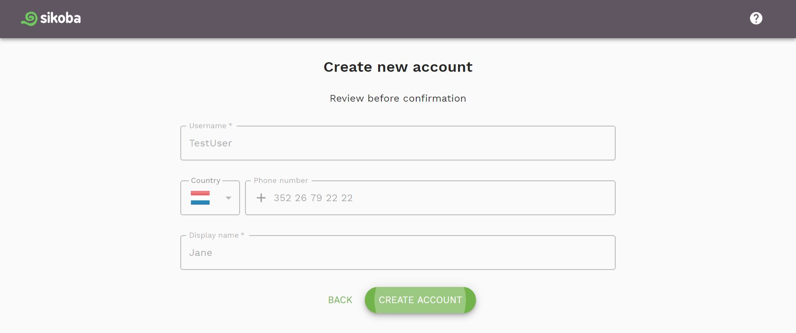
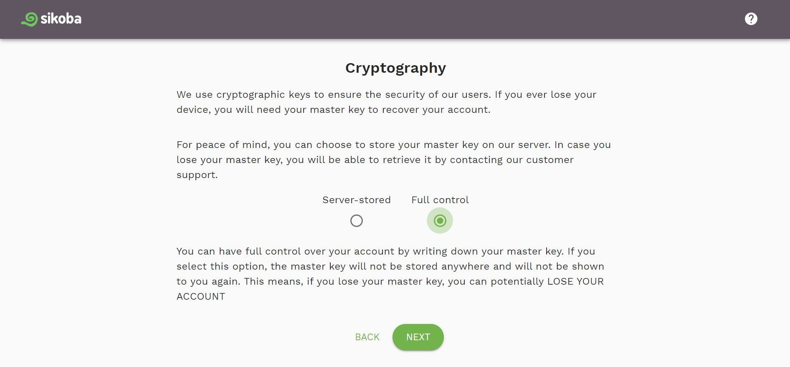
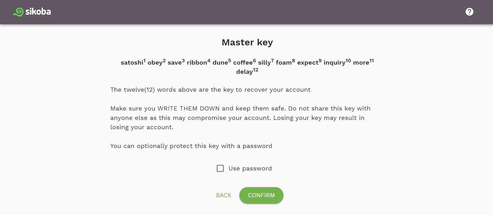
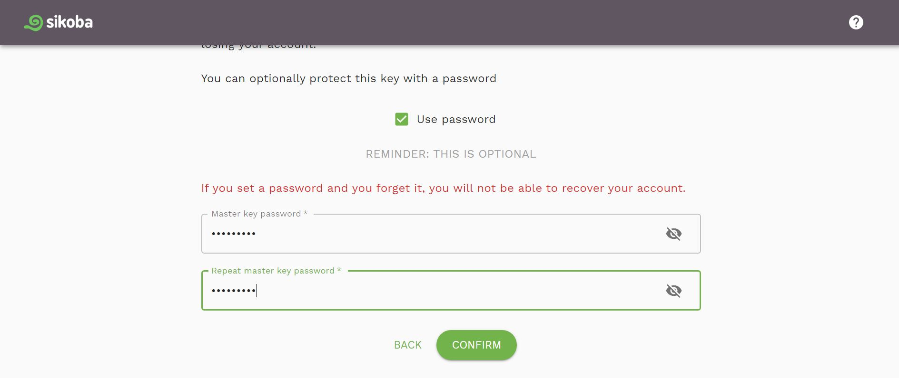

## Personal data

- Enter:
  - username - has to contain at least 6 characters
  - choose password - must contain at least 8 characters, one lower case character and one upper case character
  - repeat password
  - your beta key (can be obtained by emailing betatesters@sikoba.com)

Click *Next* button.

- On the next screen fill:
  - required fields: your first name, last name, birthdate, phone number including the country code, display name
  - optional fields: country of residence, city, email, Ethereum address  

Then click *Next* button.

## Cryptography

Select how do you prefer to store your [master key](vocabulary.md#master-key).

You can choose to store your master key on [our server](sign-up.md#server-stored) or you can have a [full control](sign-up.md#full-controll) over your account by writing down your master key.

## Server-stored

If you choose to store your master key on our server:

- check *Server-stored* option and click *Next*

- review all your data and click *Create account*

## Full controll

If you choose to have a full control over your account:

- check *Full control* option and click *See master key*

- **WRITE DOWN** your master key (12 words). If you lose it, you can potentially LOSE YOUR ACCOUNT.

- **optionally**, you can protect your master key with a password by choosing this option (or you can skip this step).

  - Enter a master key password (must contain at least 8 characters, one lower case character and one upper case character), repeat it and click *Confirm*.

  